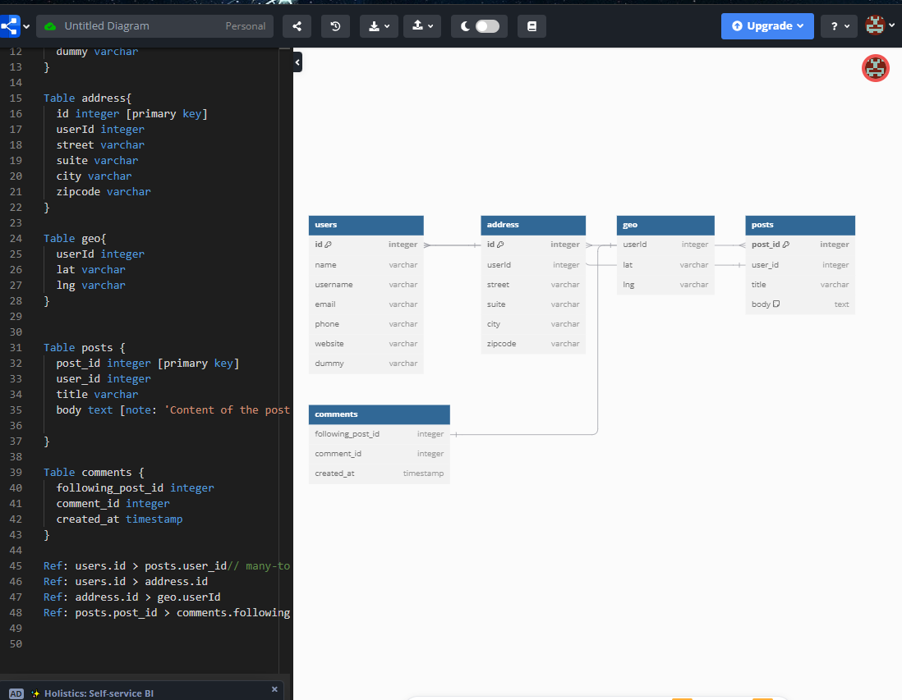

#

## List 中List 要用 FlatMap
# 幾個List 就可以用 Map放埋一齊

## 建立流程
# 用AppStartRunner係APP RUN 開始已將DATA存入DATABASE
Step: 
1. create Entity & Repository
2. create method in service.
3. autowired service class & override method in Impl.
4. use in AppStartRunner.
-->>>>  郁到 5個FILES

# 起API - Step:
1. 新增Service,override method in Impl
2. 可能郁到DTO / Mapper 去design 出去既資料形式
3. 加Operation 起URL
4. Override Operation in Controller
-->>>>  郁到 4個FILES

## Set Scheduled task (Week11-12, Topic 19)
-Cron Job
    -6個fields 冇得set 年份
    - */2  ->每2分鐘run1次
    - 可set time zone

## 用JPQL
Step:
1. @Query in Repository
2. 起 Service
3. Override ServiceImpl
4. 加Operation 起URL
5. Override Operation in Controller
   -->>>>  郁到 5個FILES

## Common Exception Classes
# IOException
Signals that an I/O exception of some sort has occurred.
Common subclasses include:
- FileNotFoundException
- EOFException
- MalformedURLException
- 
# SQLException
Provides information on a database access error or other errors.
Commonly used with JDBC for database operations.

# ClassNotFoundException
Thrown when an application tries to load a class through its string name, but no definition for the class could be found.

# NoSuchMethodException
Signals that a particular method cannot be found.

# InterruptedException
Thrown when a thread is waiting, sleeping, or otherwise occupied, and the thread is interrupted.

# IllegalArgumentException
Indicates that a method has been passed an illegal or inappropriate argument.

# NullPointerException
Thrown when an application attempts to use null in a case where an object is required.

# IndexOutOfBoundsException
Thrown to indicate that an index of some sort (such as an array or string index) is out of range.

# ArithmeticException
Thrown when an exceptional arithmetic condition has occurred, such as division by zero.

# SecurityException
Thrown by the security manager to indicate a security violation.
UnsupportedOperationException
Thrown to indicate that the requested operation is not supported.

# TimeoutException
Signals that a timeout has occurred on a blocking operation.

# ResTemplateErrorException
Call 唔到API/URL

# !!!instanceof 代表check type 是否xxtype, Java有Number type
if (id == null || id instanceof Number ) {
 throw new InvalidInputException(ErrorCode.INVAILD_INPUT.getMsg());
  